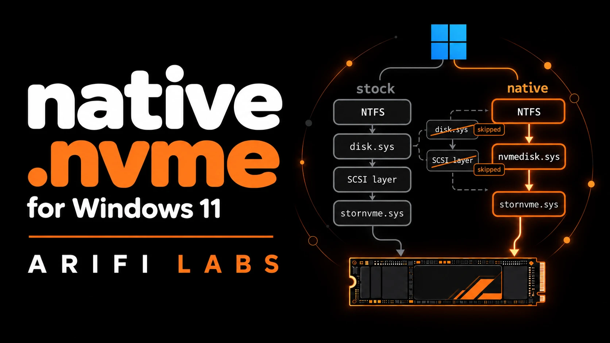

# Native NVMe on Windows 11: skip the SCSI layer, one drive at a time



Windows Server 2025 introduced a native NVMe storage stack (`nvmedisk.sys`): the disk talks NVMe directly,
without the old SCSI path (the SCSI disk driver `disk.sys` and the SCSI-to-NVMe translation in `stornvme.sys`; `stornvme.sys` still drives the controller). On Windows 11 client builds there is no
supported switch for it.

**We found one built into Windows itself.** Storport reads a per-controller registry value at boot. Set it on a
data drive, reboot, and that drive runs on `nvmedisk.sys`. Secure Boot and driver signing stay on, and no system
file is modified. Every other drive keeps the stock driver.

## Results

Same 109 GB file, same five DiskSpd read tests, 20 s each, before and after the switch.
Minisforum AI X1 Pro (Ryzen AI 9 HX 470, 96 GB), Windows 11 Insider build 29680, both drives PCIe Gen4 x4.

### Fanxiang S880 1 TB (Silicon Motion SM2268XT)

| Test | Stock: MiB/s or IOPS (CPU) | Native: MiB/s or IOPS (CPU) | Throughput | CPU used |
|---|---|---|---|---|
| Random 4 MB reads, 8 in flight, whole file | 4,743 (5.95%) | 4,792 (1.04%) | +1.0% | **-83%** |
| Random 4 MB reads, 8 in flight, 8 GB span | 4,781 (5.75%) | 4,812 (1.48%) | +0.6% | **-74%** |
| Random 4 MB reads, 8 in flight, 1 GB span | 4,950 (1.44%) | 4,955 (1.22%) | +0.1% | -15% |
| Random 4 KB reads, 32 in flight x 4 threads | 167,880 IOPS (4.13%) | 168,602 IOPS (3.12%) | +0.4% | **-24%** |
| Random 4 KB reads, 1 in flight | 10,661 IOPS (1.67%) | 10,768 IOPS (1.00%) | +1.0% | **-40%** |

### KingSpec XG7000 2 TB (Maxio MAP1602)

| Test | Stock: MiB/s or IOPS (CPU) | Native: MiB/s or IOPS (CPU) | Throughput | CPU used |
|---|---|---|---|---|
| Random 4 MB reads, 8 in flight, whole file | 5,896 (1.86%) | 5,851 (1.42%) | -0.8% | **-24%** |
| Random 4 MB reads, 8 in flight, 8 GB span | 6,458 (1.47%) | 6,469 (1.37%) | +0.2% | -7% |
| Random 4 MB reads, 8 in flight, 1 GB span | 6,475 (0.96%) | 6,453 (1.27%) | -0.3% | +32% |
| Random 4 KB reads, 32 in flight x 4 threads | 502,958 IOPS (11.52%) | 477,561 IOPS (7.26%) | -5.0% | **-37%** |
| Random 4 KB reads, 1 in flight | 12,542 IOPS (1.42%) | 12,511 IOPS (1.10%) | -0.2% | **-23%** |

**What it buys:** the drives were already at their own limit, so throughput barely moves. The CPU cost of
reading drops sharply. On the KingSpec at ~480,000 IOPS, native does **51% more reads per unit of CPU**.
That CPU goes back to whatever is consuming the data; for us, a local LLM streaming its weights from disk.

Raw numbers: [`results/diskspd-summary.csv`](results/diskspd-summary.csv). The S880 stock run is one round taken
while other jobs ran; every other arm is the mean of two rounds on a quiet machine.
[`results/diskspd-native-full.csv`](results/diskspd-native-full.csv) is a separate run of all nine `bench.ps1` tests
(adds sequential, 128 KB and write tests) on the native stack, two rounds each. Its CPU column moves a lot between
rounds, so the tables above do not use it.

## How it works

At boot, storport's AddDevice routine opens each NVMe controller's device key and reads one DWORD:

```
HKLM\SYSTEM\CurrentControlSet\Enum\PCI\<controller instance>\Device Parameters\StorPort
    EnableNativeNVMeUserSetting = 1
```

A non-zero value turns the native path on for that controller. Storport then checks the disk-class filter
drivers; if it finds one it considers incompatible, native stays off and it records `IncompatibleFilterCount`
under `HKLM\SYSTEM\CurrentControlSet\Control\StorPort`. If the check passes, the namespace is exposed as
`GenNvmeDisk`, and Microsoft's own `nvmedisk.inf` binds `nvmedisk.sys` to it.

`nvmedisk.sys` must be allowed to load: its service `Start` value must be `0` (boot start, the stock value).

We found this by reading `storport.sys` on build 29680: the value name and the code that reads it. Nothing in the
Settings app or any other Windows binary writes it on this build.

## Requirements

| What | Why | Notes |
|---|---|---|
| Windows 11 build with the storport switch | the switch lives in storport | tested on Insider Dev builds 29680 and 29683; other builds untested |
| Administrator rights + PowerShell 7 (`winget install Microsoft.PowerShell`) | the scripts write a device registry value | run `pwsh` as administrator |
| An NVMe **data** drive | first test never on the boot drive | the switch is per controller |
| A backup and a working recovery environment (WinRE) | the undo path if Windows does not start | `reagentc /info` must show WinRE Enabled |
| DiskSpd (optional) | before/after numbers | `winget install Microsoft.DiskSpd` |
| smartmontools (optional) | drive health on the native stack | Windows' own reliability counters are empty under `nvmedisk.sys`; `smartctl -a` still reads them (`winget install smartmontools.smartmontools`) |

Secure Boot and driver signing stay on; no driver or system file is installed or changed.

## Do it yourself

**Before you start:** back up. Test on a **data** drive, never your boot drive first. This is undocumented and
may change in any Windows build.

1. Install DiskSpd if you want before/after numbers: `winget install Microsoft.DiskSpd`.
2. Copy [`scripts/winre-undo.cmd`](scripts/winre-undo.cmd) to the root of your Windows drive (for example
   `C:\winre-undo.cmd`). It is your way back if Windows ever fails to start.
3. In an elevated PowerShell 7, list your controllers:
   ```
   pwsh -File scripts\enable-native-nvme.ps1 -List
   ```
4. Measure before: `pwsh -File scripts\bench.ps1 -Target <a big file on that drive> -Out .\before`. It reads that file and, unless you add `-NoWrites`, also writes and deletes a 16 GB scratch file on the same drive.
5. Enable it on one controller, using its `VEN_xxxx&DEV_xxxx` from the list:
   ```
   pwsh -File scripts\enable-native-nvme.ps1 -Match 'VEN_1E4B&DEV_1602'
   ```
   The script refuses if the boot or system disk sits behind that controller.
6. Reboot, then check: `pwsh -File scripts\enable-native-nvme.ps1 -Status`. Success looks like
   `class=NvmeDisk driver=nvmedisk` for that drive.
7. Measure after: `pwsh -File scripts\bench.ps1 -Target <same file> -Out .\after`

**Undo:** `pwsh -File scripts\enable-native-nvme.ps1 -Undo -Match '<same VEN&DEV>'`, then reboot. If Windows does not
start: Troubleshoot > Advanced options > Command Prompt, run `C:\winre-undo.cmd` (try `D:\`, `E:\` if the letter
moved), then Continue.

## Also turn off NVMe deep sleep (desktops on mains power)

Windows lets an idle NVMe drive drop into its deepest power states after a fraction of a second. Waking up from them
costs milliseconds, and workloads that read in bursts with short gaps (model loading, streamed weights) pay that on
every burst. The two settings are hidden in the power plan; this reads them and turns them off for mains power only:

```
$p = (powercfg /getactivescheme) -replace '.*GUID: (\S+).*','$1'
powercfg /qh $p 0012ee47-9041-4b5d-9b77-535fba8b1442 | Select-String 'NVMe Idle Timeout' -Context 0,6
powercfg /setacvalueindex $p 0012ee47-9041-4b5d-9b77-535fba8b1442 d639518a-e56d-4345-8af2-b9f32fb26109 0
powercfg /setacvalueindex $p 0012ee47-9041-4b5d-9b77-535fba8b1442 d3d55efd-c1ff-424e-9dc3-441be7833010 0
powercfg /setactive $p
```

Measured on the KingSpec XG7000 (native stack, Balanced plan; DiskSpd 1 MB random reads in bursts of 4 every 300 ms,
15 s, on -> off -> on, 2 runs each): average latency **3.0 ms with deep sleep on, 0.9-1.2 ms with it off**. The Windows
defaults were 200 ms (Primary NVMe Idle Timeout) and 2000 ms (Secondary). Cost: a few watts per drive at idle. Undo:
set the two values back to `200` and `2000`, then `powercfg /setactive $p`. Also check that "Turn off hard disk after"
is `0` (never) and PCI Express Link State Power Management is Off for mains power. Laptops on battery: leave the
battery (DC) values alone.

## Instructions for an AI assistant

If you ask an AI coding assistant (Claude Code, Codex, Copilot and similar) to do this for you, paste this section
to it. It is written so the assistant follows the same safe order a person would.

```text
Goal: switch ONE data NVMe drive on this Windows 11 PC to the native NVMe stack (nvmedisk.sys) using the scripts in
this folder, with a working way back. Rules:
1. Read README.md and all three scripts in scripts\ in full before running anything. Run everything in an elevated PowerShell 7.
2. Run `scripts\winre-undo.cmd test` on the running system and show me its output. Then copy winre-undo.cmd to the root of
   the Windows drive (C:\winre-undo.cmd). Do not continue until that file exists.
3. Ask me to confirm a recent backup and a restore point (Checkpoint-Computer) before any change.
4. Run `enable-native-nvme.ps1 -List`. Pick a controller whose disks are NOT marked [BOOT/SYSTEM]. Never pass
   -AllowBootDisk unless I say so in my own words after the data drive has worked through a reboot.
5. If DiskSpd is installed, run bench.ps1 on a large file on that drive (before).
6. Run `enable-native-nvme.ps1 -Match '<VEN_xxxx&DEV_xxxx>'` for that one controller. Show me the output. Ask me to
   reboot; do not reboot by yourself.
7. After the reboot, run `-Status`. Success = `class=NvmeDisk driver=nvmedisk` for that drive and no
   IncompatibleFilterCount line. Run bench.ps1 again (after) and show both results side by side.
8. If anything is wrong while Windows runs: `enable-native-nvme.ps1 -Undo -Match '<same VEN&DEV>'`, then reboot.
9. If Windows does not start, tell me: hold Shift while choosing Restart (or let Windows fail to boot twice) >
   Troubleshoot > Advanced options > Command Prompt, run C:\winre-undo.cmd (try D:\ or E:\ if the letter moved),
   then Continue. That removes the setting from every controller in the offline registry.
10. After every Windows update, run -Status again: an update can change storport.
11. On a desktop on mains power, offer the "Also turn off NVMe deep sleep" step from README.md. Read the current
    values first, show them to me, and change only the AC values after I say yes.
Never edit storport.sys, never bind nvmedisk with a custom INF (that made a PC unbootable), never turn off Secure
Boot or driver signing.
```

## What did not work

| Attempt | Result |
|---|---|
| ViVeTool feature flags (the published native-NVMe IDs and storport's own feature IDs) | No effect on this build |
| A custom INF binding `nvmedisk.sys` to the existing SCSI disk node | **Unbootable (0x7B, INACCESSIBLE_BOOT_DEVICE)**. `nvmedisk` binds only `GenNvmeDisk`, which storport exposes only in native mode, so that bind is wrong in principle. Do not do this. |
| The official Feature Preview package (KB5066835) | Built for 24H2 / 25H2 only |

## Notes

- Tested only on Windows 11 Insider builds 29680 and 29683, with Microsoft's stock NVMe controller driver (`stornvme.sys`), three consumer drives without on-board DRAM: the two data drives
  above, then the boot drive (Crucial P3 Plus, with `-AllowBootDisk`, after both data drives had worked through a
  reboot). Your results may differ.
- The switch is per controller: every namespace behind that controller goes native. Drives on a vendor NVMe driver or behind Intel RST / VMD were not tested.
- Windows updates can change storport. After an update, run `-Status` again. The native stack survived the update
  from 29680 to 29683 on all three drives (2026-10-08); that update did turn SysMain and Windows Search back on.

## License

Scripts: MIT ([`LICENSE`](LICENSE)). Text: CC BY 4.0. Arifi Labs, 2026.
